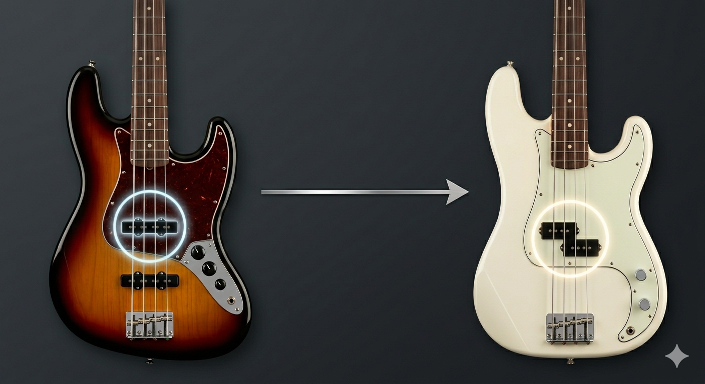
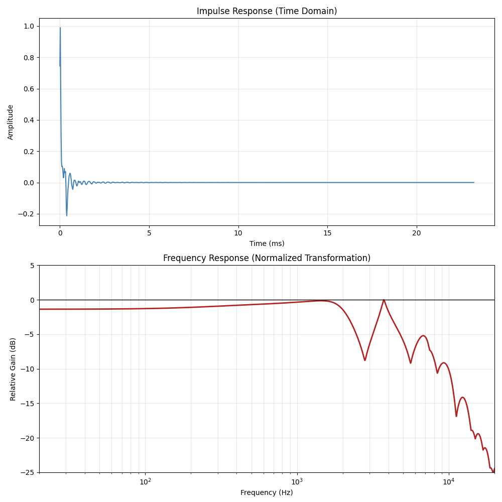

# Precifier - J-Bass to P-Bass IR Generator

This Python script generates minimum-phase Impulse Responses (IRs) designed to reshape the tone of a Fender Jazz Bass. By modeling the physical magnetic aperture and electrical circuits of specific hardware, it allows you to match a J-Bass (Neck) pickup to a Precision Bass or a J-Bass (Bridge) pickup to a Music Man StingRay.

The script produces .wav files compatible with standard IR loaders (Helix, Quad Cortex, Kemper, or DAW plugins). It functions as a physics-based EQ that accounts for the harmonic footprint and electrical resonance of each instrument.



### Download IRs

If you don't want to mess with Python or can't run the script yourself, you can just download the pre-generated IRs below. 

Select the format that matches your hardware or DAW session. If you are unsure, **48k / 24-bit** is the most common standard for modern modelers like the Helix and Quad Cortex.

#### J-Bass Neck -> P-Bass

| Sample Rate | 16-bit | 24-bit | 32-bit float |
| :--- | :--- | :--- | :--- |
| **44.1 kHz** | [Download](./J_Bass_Neck_to_P_Bass_44k_16bit.wav?raw=true) | [Download](./J_Bass_Neck_to_P_Bass_44k_24bit.wav?raw=true) | [Download](./J_Bass_Neck_to_P_Bass_44k_32float.wav?raw=true) |
| **48 kHz** | [Download](./J_Bass_Neck_to_P_Bass_48k_16bit.wav?raw=true) | [Download](./J_Bass_Neck_to_P_Bass_48k_24bit.wav?raw=true) | [Download](./J_Bass_Neck_to_P_Bass_48k_32float.wav?raw=true) |
| **88.2 kHz** | [Download](./J_Bass_Neck_to_P_Bass_88k_16bit.wav?raw=true) | [Download](./J_Bass_Neck_to_P_Bass_88k_24bit.wav?raw=true) | [Download](./J_Bass_Neck_to_P_Bass_88k_32float.wav?raw=true) |
| **96 kHz** | [Download](./J_Bass_Neck_to_P_Bass_96k_16bit.wav?raw=true) | [Download](./J_Bass_Neck_to_P_Bass_96k_24bit.wav?raw=true) | [Download](./J_Bass_Neck_to_P_Bass_96k_32float.wav?raw=true) |

#### J-Bass Bridge -> MusicMan Stingray

| Sample Rate | 16-bit | 24-bit | 32-bit float |
| :--- | :--- | :--- | :--- |
| **44.1 kHz** | [Download](./J_Bass_Bridge_to_MusicMan_44k_16bit.wav?raw=true) | [Download](./J_Bass_Bridge_to_MusicMan_44k_24bit.wav?raw=true) | [Download](./J_Bass_Bridge_to_MusicMan_44k_32float.wav?raw=true) |
| **48 kHz** | [Download](./J_Bass_Bridge_to_MusicMan_48k_16bit.wav?raw=true) | [Download](./J_Bass_Bridge_to_MusicMan_48k_24bit.wav?raw=true) | [Download](./J_Bass_Bridge_to_MusicMan_48k_32float.wav?raw=true) |
| **88.2 kHz** | [Download](./J_Bass_Bridge_to_MusicMan_88k_16bit.wav?raw=true) | [Download](./J_Bass_Bridge_to_MusicMan_88k_24bit.wav?raw=true) | [Download](./J_Bass_Bridge_to_MusicMan_88k_32float.wav?raw=true) |
| **96 kHz** | [Download](./J_Bass_Bridge_to_MusicMan_96k_16bit.wav?raw=true) | [Download](./J_Bass_Bridge_to_MusicMan_96k_24bit.wav?raw=true) | [Download](./J_Bass_Bridge_to_MusicMan_96k_32float.wav?raw=true) |

## How It Works

The script calculates the transfer function between the two pickups by modeling three primary domains:

* **Aperture Width (Comb Filtering):** Models the physical width of the magnetic field. The wider P-Bass coil naturally filters higher frequencies compared to the narrower J-Bass coil. This is simulated using a sinc function with magnetic fringe field compensation.
* **RLC Electronics (Loaded Resonance):** Pickups act as second-order low-pass filters. The script models the **Resonant Frequency ($f_r$)** and **Quality Factor ($Q$)** of the pickups as they behave under a standard load (250k pots and a guitar cable).
* **Dual-coil Comb Filtering:** Simulates the phase cancellation caused by spatial separation in humbuckers.

The generator uses **Wiener Deconvolution** to calculate the spectral ratio between the target and the source, then converts the result into a **Minimum-Phase** response. This ensures the resulting IR has zero latency and introduces no pre-ringing artifacts.

### Frequency Response
The following plot shows the frequency response of the generated IR using default settings.



### Audio Examples

**Source (Original Input):**
[`original_input.wav`](original_input.wav)

**Target (Converted Output):**
[`convolved_output.wav`](convolved_output.wav)

## Usage

Simply run the script from your terminal. By default, it automatically generates both J_Bass_Neck -> P_Bass and J_Bass_Bridge -> MusicMan conversions:

```bash
uv run generate_ir.py
```

You can also map specific models using arguments:

```bash
uv run generate_ir.py --source J_Bass_Bridge --target MusicMan
```

The script will automatically generate impulse responses in the current working directory, peak-normalized to -0.1 dB to prevent clipping.

### Option 2: Using pip
If you do not have uv:

```bash
pip install numpy scipy soundfile matplotlib
```

```bash
python generate_ir.py
```

### Output Formats
To ensure maximum compatibility with both hardware pedals and software plugins, the script exports IRs across multiple industry-standard formats:
* Sample Rates: 44.1kHz, 48kHz, 88.2kHz, 96kHz
* Bit Depths: 16-bit integer, 24-bit, and 32-bit float.
* IR Length: 2048 taps

### Demo Script

To hear the transformation and visualize the math, run the included `demo_ir.py` script. Note: **You must run the main generator script first** to ensure the IR files are available.

Provide the path to an IR file and a dry input audio file (e.g., a bass recording):

```bash
python demo_ir.py J_Bass_Neck_to_P_Bass_48k_24bit.wav your_bass_clip.wav
```

* **Audio Output:** Convolves the dry input to generate `convolved_output.wav` (processed) and copies the original to `original_input.wav`.
* **Visual Output:** Generates `ir_analysis.png` showing the impulse response and frequency response.
* **Web Preview:** Creates `preview.html` for easy comparison in a browser.

Open `preview.html` in your browser to listen and see the analysis.

## Customizing the Tone

You can easily tweak the source and target pickup characteristics by modifying the PICKUPS dictionary in the script. The default values are tuned for a standard loaded bass circuit:

| Parameter | Fender Jazz Bass (Neck) | Fender Precision Bass | Music Man StingRay | Description |
| :--- | :--- | :--- | :--- | :--- |
| w | 0.75 | 1.00 | 1.50 | Aperture Width (inches). Larger values equal more high-end roll-off. |
| gain | 1.0 | 1.4 | 2.2 | Relative Output. P-pickups generally have higher output. StingRay has active preamp. |
| f_r | 3000.0 | 2000.0 | 3800.0 | Resonant Frequency (Hz). The electrical peak. P-basses sit lower in the high-mids. |
| Q | 1.4 | 1.6 | 1.2 | Quality Factor. How sharp the resonant peak is. |

## License
MIT License. Feel free to use, modify, and distribute!
